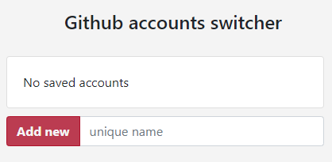
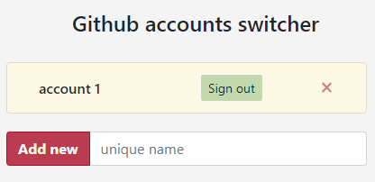
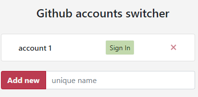
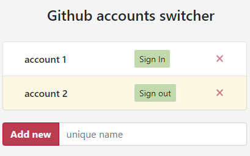
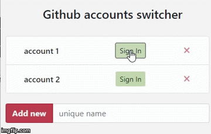

# SwitchGithubAccounts
Chrome extension to switch between multiple accounts on Github

## Installation

1. Download this project
2. Unzip the folder wherever you'd like.
3. Go to Chrome extensions page (chrome://extensions/) and load the folder as an Unpacked extension.
    
## How it works

This extension uses cookies to manage your accounts.
It just saves cookies to local storage and swipes it when you swipe you accounts.

This extension **DOES NOT** send or collect any data.

___
    
## How to use

1. After you installed **Account Switcher** and opened Github page you can click on the 
logo and see the following:

2. If you are signed in you can add you account into list. 
Just paste a unique name for account and click **Add new**
And now you are able to sign in and sign out from your account through the extension.
  

3. You should always use extension to login and logout from Github. Just click **Sign out** button.
    

4. After you clicked logout button you will be logged out and free to sign in to another account.
Then you just should repeat step 2 to add more accounts. Remember to give them unique names.
    

___

That`s all you need to manage you account without any login and passwords!

